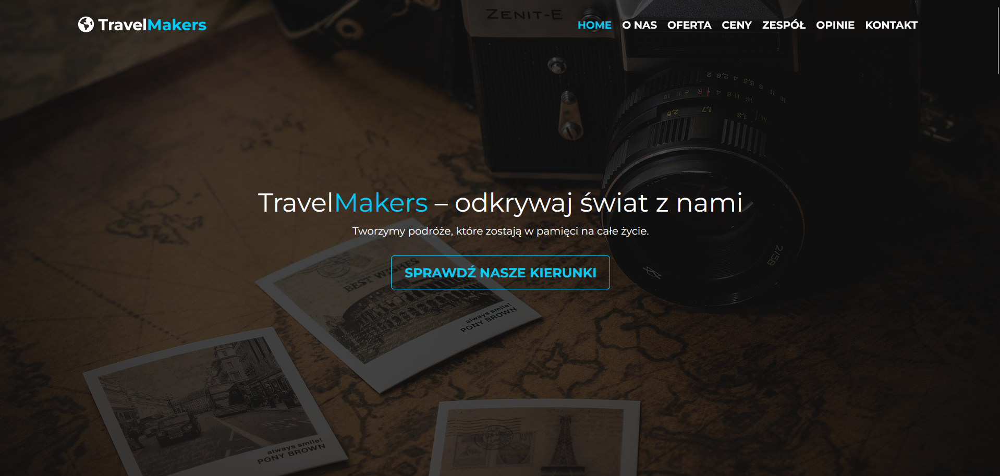
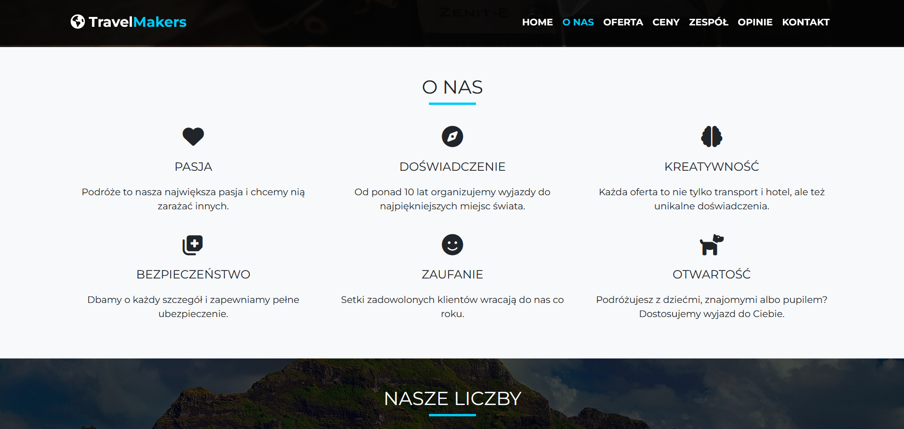

# Travel Agency Website

A responsive website for a fictional travel agency, built with **HTML**, **SCSS**, **Bootstrap**, and **JavaScript**.

## ✨ Features

- Responsive design
- Custom SCSS styles
- Interactive navigation menu
- Image carousel implemented with JavaScript
- Layout styled with Bootstrap

## 🛠️ Technologies Used

- HTML5
- SCSS
- Bootstrap 5
- JavaScript

## Demo

👉 [Live Demo](https://angelika-musial.github.io/travel-agency/)

## 📸 Screenshots

### Homepage



### About-us Section



## 🚀 Installation

Clone the repository:

```bash
git clone https://github.com/angelika-musial/travel-agency.git
```

## License

This project was created for educational and portfolio purposes only.
